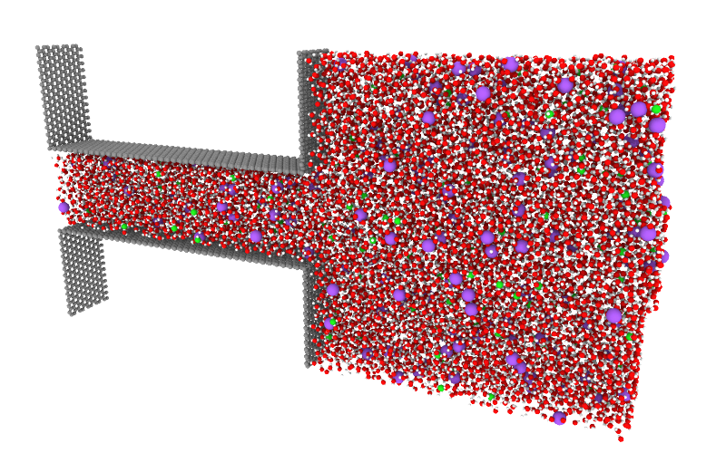

# A 2D slit configuration

Example of how to initialize and simulate the flow of ions and water molecules under the effect of an electric field (or a pressure drop) through a two-dimensional channel.  
Here, the two-dimensional channel is oriented along $z$, has height $H_c$, length $L_c$ and infinite width (periodicity along $y$). The wall upstream, resp. downstream, of the channel is called top, resp. bottom layer

## File structure
- `commands.sh` : It is a bash file giving the commands to execute to launch a molecular dynamics simulation.
- `run.lmps` : This is the main file of the simulation, interpreted by LAMMPS. It is divided in 4 parts: an initialization during which the initial atomic configuration is built, an energetic minimization, a thermalization and a long time simulation. In this file you can modify the header to change the parameters of the simulation such as ion concentration, electric field amplitude, pressure difference, seed to generate the initial configuration, etc...
- `forcefield.ff` : General information about the force fields used. Caution some parameters given in this file can be overwritten (like the charge of the atoms in the top and bottom layers). 
- `spce.mol` : The file defining the water model (here, SPCE).
- `slit_builder.py`: A Python script that generates the atomic configuration of the 2D channel. The script should work as long as you have a classic anaconda distribution.

